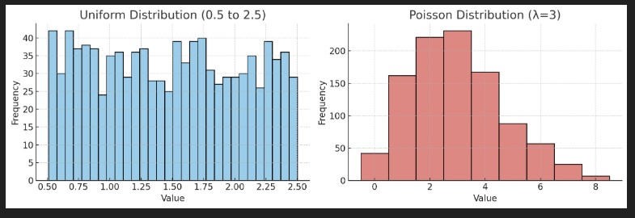
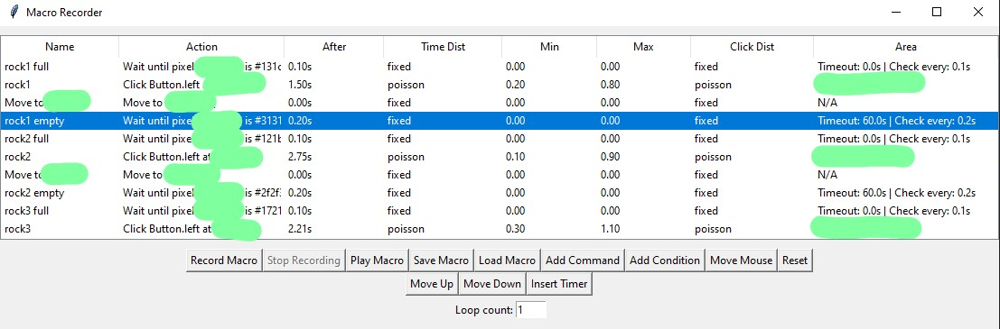

# MacroOSRS
Advanced Macro Recorder with randomnes, delays and conditions

# Introduction
Macro recorder and editor primarly made for Old School Runescape (OSRS). I **DO NOT** offer any support or warranties for the use of this software. Use at your own risk. This software is not affiliated with Jagex or Old School Runescape in any way. This software is intended for educational purposes only and should not be used to gain an unfair advantage in any game.

I made some effort to make this software as safe as possible to use with randomizing each action. However, I cannot guarantee that this software will not be detected by Jagex or any other game. Use at your own risk.

# Features
- Exit current macro with ```Ctrl + Esc```
- Allows for macro recording, playing and editing. Offers 3 types of delays, fixed, uniform distribution and poission distribution.
- Add new command
- Edit existing commands
- Command for only mouse movement (no clicks)
- Saving and loading macros in JSON format
- Looping macros

# Randomness
## Right click -> Modify Time Distribution
- Fixed: The time before selected action is fixed to the value you set. This is the most predictable and least random option.
- Uniform: The time before selected action is randomly chosen from a uniform distribution between the two values you set.
- Poisson: The time before selected action is randomly chosen from a poisson distribution with the two values you set. 
<!-- image -->


# GUI (hidden coordinates for security reasons)


## Right click -> Modify Click Area
Same randomnes options, program will ask you for top left and bottom right coordinates of the area you want to randomize the click in. The click will be randomly chosen from the area you set. This is useful for making your clicks less predictable and more human-like.

## Right click -> Modify Command
Will ask you to input new command. Click mouse or keyboard to set it.

## Add condition
Will ask you to click on the screen, it will take this pixel coordinates and its RGB value. The macro will check that condition before releasing the flow to the next step. Supports timeout, interval check and True and False conditions.

## Right click -> Edit Condition
Modify the condition values you set. 


### Made with ChatGPT, ClaudeAI and DeepSeek

### Known Issues
- when adding the condition screen freezes for few seconds + possible of getting error, just try again
- when loading the macro with conditions, sometimes colors are not matched, will need to readd all the conditions again